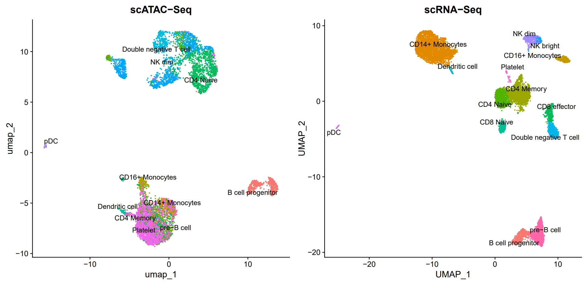
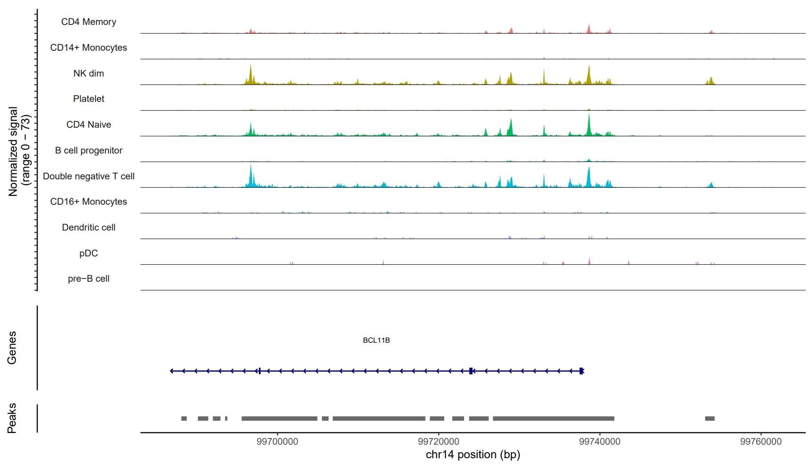

# scATAC-seq_analysis_Seurat_Signac


### **scATAC-seq and scRNA-seq integration**


### **Coverage plot for BCL11B gene**

Welcome to this hands-on workflow for exploring single-cell ATAC-seq (scATAC-seq) data and integrating it with single-cell RNA-seq (scRNA-seq) data in R. If you’re curious about how chromatin accessibility relates to gene expression at the single-cell level, you’re in the right place.

This pipeline is built around 10x Genomics PBMC data, but you can easily adapt it for your own samples. The code is **deeply commented** and structured to help you learn, tweak, and extend as you go.

---

## Why Integrate scATAC-seq and scRNA-seq?

Single-cell ATAC-seq tells you where the genome is open and potentially active, while scRNA-seq tells you which genes are actually being transcribed. By combining them, you can:
- **Assign cell types** to scATAC-seq clusters using scRNA-seq as a reference
- **Link regulatory elements to gene expression**
- **Discover cell-type-specific regulatory programs**

---

## What’s in This Pipeline?

This workflow guides you through:
- **Loading and inspecting your scATAC-seq data**
- **Attaching gene annotations to peaks**
- **Quality control and filtering**
- **Normalization, dimensionality reduction, and clustering**
- **Calculating gene activity scores**
- **Integrating with scRNA-seq for cell type annotation**
- **Finding differentially accessible peaks**
- **Visualizing genomic regions and marker genes**

Each step is explained in the code, so you’ll always know what’s happening and why.

---

## What You’ll Need

### R Packages

You’ll need the following R packages. If you haven’t installed them yet, here’s how:

```r
install.packages("tidyverse")
if (!requireNamespace("BiocManager", quietly = TRUE))
    install.packages("BiocManager")
BiocManager::install(c("Signac", "Seurat", "EnsDb.Hsapiens.v75", "SingleR"))
```

- **Seurat:** The backbone for single-cell analysis in R.
- **Signac:** Adds scATAC-seq support to Seurat.
- **EnsDb.Hsapiens.v75:** Human gene annotation (for other organisms, swap this out).
- **tidyverse:** For data wrangling and plotting.
- **SingleR:** Optional, for automated cell type annotation.

### Input Files

Put these files in your working directory (or update the paths in the script):

| File | Description |
|------|-------------|
| `atac_v1_pbmc_10k_filtered_peak_bc_matrix.h5` | 10x Genomics scATAC-seq peak-cell matrix |
| `atac_v1_pbmc_10k_fragments.tsv.gz` | 10x Genomics scATAC-seq fragment file |
| `atac_v1_pbmc_10k_singlecell.csv` | Cell-level metadata for scATAC-seq |
| `pbmc_10k_v3.rds` | Pre-processed Seurat object with scRNA-seq and cell type annotations |

Download links:
1. [10k pbmc scATAC-seq datasets](https://www.10xgenomics.com/datasets/10-k-peripheral-blood-mononuclear-cells-pbm-cs-from-a-healthy-donor-1-standard-1-0-1)
2. [Preprocessed scRNA-seq data](https://signac-objects.s3.amazonaws.com/pbmc_10k_v3.rds)

If you’re using your own data, make sure the formats match or adjust the code as needed.

---

## Step-by-Step Workflow

Here’s how the pipeline unfolds, with a peek behind the scenes at each stage:

### 1. **Load and Preview Data**

Start by loading your scATAC-seq count matrix, fragment file, and metadata. It’s always a good idea to peek at the first few rows—just to make sure everything looks as expected.

### 2. **Gene Annotation**

We pull in gene annotations from EnsDb (or your favorite annotation source) and attach them to the ATAC peaks. This step is crucial for linking open chromatin regions to genes later on.

### 3. **Quality Control (QC)**

Not all cells are created equal! We calculate:
- **Nucleosome signal** (to spot apoptotic or low-quality cells)
- **TSS enrichment** (a hallmark of good ATAC-seq)
- **Blacklist ratio** (to flag artifacts)
- **Fraction of reads in peaks** (signal-to-noise)

We visualize these metrics with scatterplots and violin plots, so you can see where to set your QC thresholds.

### 4. **Filtering**

Based on the QC plots, we filter out low-quality cells. The thresholds are set for PBMCs, but you can adjust them for your own data.

### 5. **Normalization & Dimensionality Reduction**

We normalize the data using TF-IDF (which balances out differences in sequencing depth and peak frequency), select the most informative peaks, and reduce dimensionality with SVD (LSI). UMAP then projects the data into two dimensions for visualization.

### 6. **Clustering & Visualization**

We cluster the cells and plot them in UMAP space. This is where you start to see the structure of your data—groups of cells that share similar chromatin accessibility profiles.

### 7. **Gene Activity Calculation**

We estimate gene activity by aggregating accessibility over gene bodies and promoters. This gives us a rough proxy for gene expression, which is super helpful for interpreting clusters.

### 8. **Integration with scRNA-seq**

Here’s where the magic happens:  
- Load your scRNA-seq reference (with cell type labels).
- Find “anchors” between the two datasets.
- Transfer cell type labels from RNA to ATAC data.
- Visualize the results side-by-side to see how well the integration worked.

### 9. **Differential Accessibility Analysis**

We identify peaks that are more accessible in one cell type than another, using logistic regression and adjusting for sequencing depth. We visualize the top peaks and calculate fold changes.

### 10. **Genomic Visualization**

Finally, we plot coverage tracks for regions of interest (e.g., top differential peaks or marker genes). You can even launch an interactive browser to explore the data in detail.

---

## How to Use This Pipeline

1. **Clone the repository:**
   ```bash
   git clone https://github.com/linkangit/scATAC-seq_analysis_Seurat_Signac.git
   cd scATAC-seq_analysis_Seurat_Signac
   ```

2. **Prepare your input files** as described above.

3. **Open the main R script** (`analysis.R`) in RStudio or your favorite R environment.

4. **Run the script section by section.**  
   Each part is clearly commented and can be run independently. Check your results as you go!

5. **Customize as needed:**  
   - Adjust file paths and QC thresholds for your data.
   - Swap in different gene annotation sources for other organisms.
   - Use your own scRNA-seq reference for label transfer.

---

## What You’ll Get

- **UMAP plots** of scATAC-seq and scRNA-seq data, before and after integration
- **Cell type annotations** for your scATAC-seq clusters
- **Lists of differentially accessible peaks** between cell types
- **Coverage plots** for any genomic region you want to explore
- **Gene activity plots** for canonical marker genes

Check the `/results` folder for example outputs.

---

## Troubleshooting & Tips

- **Package issues?**  
  Make sure you’re using a recent version of R (≥4.0) and Bioconductor.
- **Memory errors?**  
  Try running on a machine with more RAM, or use a subset of your data for testing.
- **Genome build mismatch?**  
  Make sure your annotation and data use the same genome build (e.g., hg19 vs. hg38).
- **Not seeing expected clusters?**  
  Try adjusting the number of dimensions used for UMAP and clustering, or revisit your QC thresholds.

If you get stuck, open an issue here on GitHub. I’m happy to help!

---

## References

- [Seurat](https://satijalab.org/seurat/)
- [Signac](https://stuartlab.org/signac/)
- [10x Genomics](https://www.10xgenomics.com/)
- [SingleR](https://bioconductor.org/packages/release/bioc/html/SingleR.html)

---

## License

MIT License. See [LICENSE](LICENSE) for details.

---

**Questions or suggestions?**  
Open an issue or pull request.  
Happy single-cell exploring! 🚀

---
